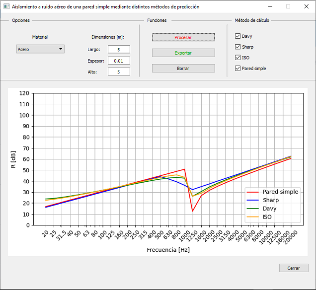

# simple_wall-acoustic_isolation
Aislamiento a ruido aéreo de una pared simple mediante distintos métodos de predicción

GUI desarrollada en Python que sirve para predecir el aislamiento acústico aéreo de paramentos simples y homogéneos, a partir de sus características físicas.

A partir de una base de datos proveniente de un archivo de excel, provee en forma gráfica los valores de Reducción Sonora (R) de una pared simple, entre 20 - 20000 Hz en bandas de tercio de octava. Se emplean los siguientes métodos:

* Ley de masa - Ley de masa corregida
* Modelo ISO 12354-1
* Modelo Sharp
* Modelo Davy

De ser deseado, devuelve un archivo excel con la información en tablas y gráficos.

Figura ejemplo de la GUI.

  

